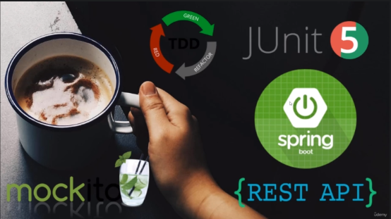

  <h4 align="center"> 
    🚧  Library API🚀 Em Construção... 🚧
  </h4>
   

  

    
  

  

    
    
    
    
  

  

    • <a href="#-sobre-o-projeto">Sobre</a> •
     <a href="#-atividades">Atividades</a> •
     <a href="#-tecnologias">Tecnologias</a> • 
     <a href="#-autor">Autor</a> • 
  

## 💻 Sobre o projeto

  - Conceitos fundamentais sobre testes automatizados e API's RESTFul, além de boas práticas e Clean Code em integrações.
  - Criação de API's RESTFul utilizando a técnica do TDD (Test Driven Development), desenvolvendo orientado a testes uma API RESTFul utilizando Spring Boot.

---

## ⚙️ Atividades
  
- [x] Modelar uma API RESTFul, utilizando os métodos HTTP, códigos de resposta, etc.
- [x] Criar serviço de agendamento de tarefas e envio de emails com Java;
- [x] Documentação de API's com Swagger
- [x] Implementação de testes automatizados;
- [x] Configuração de Deploy Contínuo;
- [ ] Publicação da API na nuvem.

## 🛠 Tecnologias

As seguintes ferramentas foram usadas na construção do projeto:

- Backend: **[Java](https://openjdk.java.net/install/)**
- Gerenciador de Depêndencias: **[Maven](https://maven.apache.org/download.cgi)**
- Documentação de API's: **[Swagger](https://swagger.io/)**
- Teste unitário e Integração: **[JUnit 5](https://junit.org/junit5/docs/current/user-guide/), [AssertJ](https://joel-costigliola.github.io/assertj/), [Mockito](https://site.mockito.org/)**
- Deploy Contínuo: **[Travis CI](https://travis-ci.org/)**
- Cobertura de Código: **[JaCoCo](https://www.eclemma.org/jacoco/trunk/doc/maven.html), [Codecov](http://about.codecov.io/)**
- Deploy: **[Heroku](https://www.heroku.com/)**

**Utilitários**

-   IDE:  **[Spring Tool Suite](https://spring.io/tools)**

## 🦸 Autor
---

<a href="#">
 
  

Feito por Douglas Souza 👋🏽 Entre em contato!

 

 
---

##  Versões do README

[Português 🇧🇷](./README.md) 
